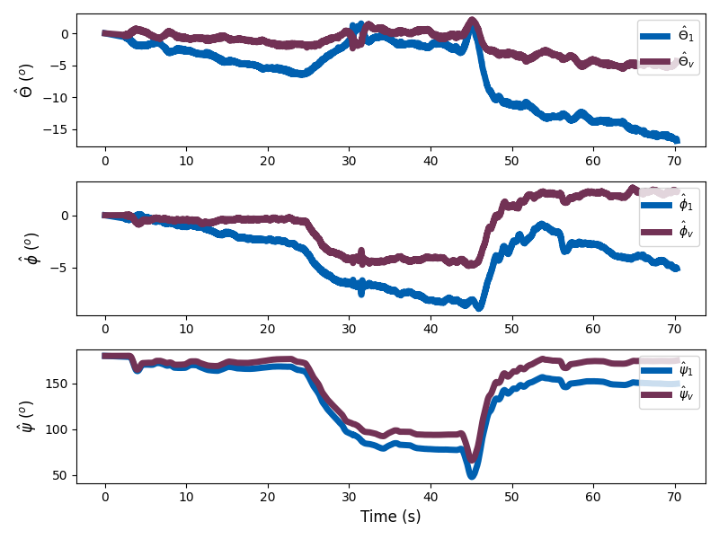

# Sensor Fusion for Distributed Inertial Measurement Units

This repository contains the code for multi-IMU sensor fusion. This software is an implementation of our paper, *Sensor Fusion for Distributed Inertial Measurement Units*, by Su-Yeon Choi, Holly Dinkel, David Hanley, and Timothy Bretl. All code is implemented in Python, and the paper preprint is shared [**here**](https://hollydinkel.github.io/assets/pdf/AAS2025.pdf). 

## Motivation

The measurements of multiple MEMS IMUs are fused into a virtual IMU. The fusion algorithm takes time-synchronized measurements from an arbitrary number of sensors and produce one virtual measurement estimate. Allan variance is used to evaluate ARW, VRW, and RRW noise performance for the estimated angular velocity and linear acceleration measurements. The noise performance of the virtual sensor measurement estimates and of the single-sensor measurements is compared. Sensor fusion is demonstrated with the simulated data of up to 18 MEMS IMUs and for real data collected by 5 MEMS IMUs.


**Figure 1:** Five IMUs, one RGBD camera, and a device running Google Tango are mounted on a mobile robot to collect data for sensor fusion and navigation algorithm testing.

<p align="center">
  
  
  
</p>

**Figure 2:** Comparing state estimation of a single MEMS IMU to the virtual IMU fusing measurements from five real sensors on data collected with the ground robot in a hallway demonstrates the significant deviation and error accumulation IMU-only state estimation introduces.

## Bibtex

```bash
@ARTICLE{choi2023fusion,
  author={Choi, Su-Yeon and Dinkel, Holly and Hanley, David and Bretl, Timothy},
  journal={AAS/AIAA Spaceflight Mechanics Meeting}, 
  title={Sensor Fusion for Distributed Inertial Measurement Units}, 
  year={2025}
}
```
